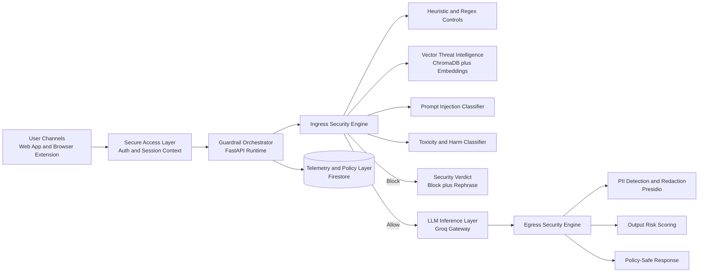
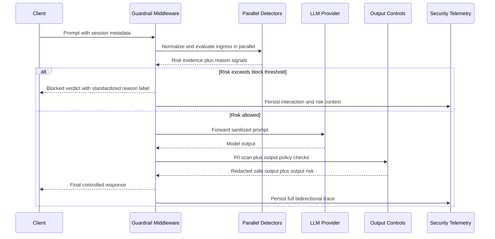

# Guardrail Security Layer

<p align="left">
  
  
  
  
  
  
  
  
  
  
</p>

Production-grade bidirectional security orchestration layer for GenAI systems, designed to control model risk before and after inference.

Guardrail Security Layer is built as a high-assurance middleware plane between user-facing clients and foundation models. It fuses rule-driven detection, vector intelligence, and model-based risk scoring to enforce policy in real time across the full prompt-response lifecycle. The platform is engineered for advanced threat scenarios including jailbreak mutation, prompt injection chains, harmful instruction requests, data leakage, and response-side PII exposure.

## 1) Executive Overview

Large language model applications fail across two critical attack surfaces:

1. Ingress: malicious or manipulative prompts entering the model context.
2. Egress: unsafe, sensitive, or policy-violating content leaving the model.

Guardrail Security Layer solves this as a dedicated inference security plane with:

1. Parallel multi-signal ingress analysis.
2. Deterministic risk actions (allow, sanitize, block).
3. Standardized security reason taxonomy.
4. Output sanitization and exposure controls.
5. Persistent auditability and policy observability.

## 2) Problem Definition

Modern AI assistants can fail in two directions:

1. Ingress risk (user to model): prompt injection, jailbreak attempts, harmful instruction requests, policy bypass attempts.
2. Egress risk (model to user): PII leakage, unsafe/generated harmful content, policy-inconsistent outputs.

Most implementations secure only one side. This project secures both directions with explicit policy thresholds, model-backed detection, and auditable telemetry.

## 3) Solution Objectives

1. Enforce request-time guardrails before model generation.
2. Enforce response-time guardrails before user delivery.
3. Maintain explainable risk decisions with normalized block reasons.
4. Operate with local model paths when available and cloud fallback when not.
5. Persist security events to Firestore with local fallback mode.

## 4) Architecture



### Threat-processing sequence



### Runtime components

| Layer | Responsibility |
|---|---|
| Frontend | User chat, auth, and risk display |
| Extension | Browser-side prompt validation and safe injection workflow |
| FastAPI middleware | Core ingress/egress orchestration and API surface |
| Ingress engine | Rules + ML + vector decisions before LLM call |
| Egress engine | PII masking and output risk evaluation |
| Storage | Firestore interaction logs and policy state |

## 5) Guardrail Decision Pipeline

### Ingress controls

1. Text normalization for obfuscation-resistant checks.
2. Rule checks for system extraction and explicit bypass intent.
3. ML ensemble scoring in parallel:
   - Prompt-injection model.
   - Toxicity model.
4. Vector similarity against jailbreak seed corpus using ChromaDB embeddings.
5. Harmful-instruction detector for requests such as weapon or explosive construction.
6. Unified risk score compared with policy thresholds.

### Egress controls

1. Model response scanning for sensitive entities.
2. Redaction using Presidio anonymization pipeline.
3. Output risk assignment and redaction reporting.

### Standardized block reason labels

| Label | Typical trigger |
|---|---|
| Prompt blocked | Harmful instruction intent or toxic harmful request |
| Prompt Injection detected | Override/system extraction injection patterns |
| Jailbreak detected | Jailbreak semantics from heuristic or vector evidence |

## 6) Model and Inference Stack

| Function | Model / Service | Role in pipeline |
|---|---|---|
| Embedding intelligence | sentence-transformers/all-MiniLM-L6-v2 | Semantic retrieval for jailbreak-adjacent prompt matching |
| Primary prompt injection detection | xTRam1/safe-guard-classifier | High-sensitivity ingress classifier for injection patterns |
| Alternate injection model profile | protectai/deberta-v3-base-prompt-injection | Optional hardened model profile for comparative deployment |
| Toxicity and harmful intent | unitary/toxic-bert | Harmful language and abuse intent scoring |
| Generation and controlled rephrase | Groq API with llama-3.1-8b-instant (default) | Core generation path and policy-safe rewrite path |

### Model resolution behavior

The backend resolves each model from local artifacts when the configured local path contains model files. Otherwise it falls back to the configured model name.

### Hugging Face model provisioning

The local model bootstrap script can provision multiple model families for offline-first or low-latency security inference:

1. sentence-transformers/all-MiniLM-L6-v2
2. xTRam1/safe-guard-classifier
3. unitary/toxic-bert
4. protectai/deberta-v3-base-prompt-injection

## 7) Technology Stack

| Domain | Stack |
|---|---|
| Backend API | FastAPI, Uvicorn, Pydantic Settings |
| Security and NLP | Transformers, SentenceTransformers, Presidio, custom regex/heuristics |
| Vector intelligence | ChromaDB |
| LLM gateway | Groq |
| Frontend | React 18, Vite, Axios, Firebase Web SDK |
| Browser extension | Chrome Extension MV3 baseline |
| Persistence | Firebase Admin SDK, Firestore |
| Quality and testing | Pytest, Ruff, secret scanning scripts |

## 8) Quick Start

### Prerequisites

1. Windows PowerShell
2. Python 3.11+
3. Node.js 20+
4. npm 10+

### 8.1 Clone

```powershell
git clone <your-repository-url>
cd Guardrail-Security-Layer
```

### 8.2 Python environment

```powershell
py -3.11 -m venv .venv
.\.venv\Scripts\Activate.ps1
pip install -r backend\requirements.txt
```

Optional Presidio NLP enhancement:

```powershell
python -m spacy download en_core_web_lg
```

### 8.3 Install Node workspaces

```powershell
npm install
```

### 8.4 Download local model artifacts

```powershell
$env:PYTHONPATH='backend'; .\.venv\Scripts\python.exe backend\scripts\setup_local_models.py
```

This setup downloads model folders under backend/models including:

1. all-MiniLM-L6-v2
2. safe-guard-classifier
3. toxic-bert
4. deberta-v3-base-prompt-injection

### 8.5 Start services (separate terminals)

Terminal 1:

```powershell
npm run dev:backend:stable
```

Optional hot-reload backend mode:

```powershell
npm run dev:backend
```

Terminal 2:

```powershell
npm run dev:frontend
```

Optional:

```powershell
npm run dev:extension
```

## 9) Validation and Operations

### Core checks

```powershell
$env:PYTHONPATH='backend'; .\.venv\Scripts\python.exe -m pytest -q backend/tests
```

```powershell
$env:PYTHONPATH='backend'; .\.venv\Scripts\python.exe backend\scripts\print_routes.py
```

```powershell
npm run build --workspace @guardrail/frontend
```

### Security checks

```powershell
npm run security:scan
```

```powershell
npm run security:scan-history
```

## 10) Advanced Security Capabilities

1. Hybrid deterministic plus probabilistic threat scoring.
2. Multi-model ingress fusion with risk threshold governance.
3. Vector-assisted jailbreak semantic proximity detection.
4. Policy-standardized reason labels for downstream SOC analysis.
5. Optional safe rephrase generation for blocked user flows.
6. Bidirectional observability with persistent risk telemetry.
7. Runtime model resolution with local-first execution strategy.

## 11) Firestore Data and Policy Governance

The middleware writes live interaction telemetry and policy state to Firestore, with local fallback behavior when Firebase is unavailable.

Primary collections:

1. interactions
2. sessions
3. users
4. policies
5. threat_patterns
6. analytics_cache

Additional schema details are documented in docs/firestore_schema.md.

## 12) Current Implementation Status

| Area | Status |
|---|---|
| FastAPI guardrail middleware | Implemented |
| Bidirectional ingress and egress checks | Implemented |
| Local model path resolution | Implemented |
| Firebase logging and policy sync | Implemented |
| React frontend security chat | Implemented |
| Browser extension advanced React/Plasmo runtime | Baseline scaffold |
| SDK starters | Baseline scaffold |

## 13) Troubleshooting

1. Use http://127.0.0.1:8000 for local backend tests.
2. If backend port is busy, rerun npm run dev:backend:stable.
3. If a model does not load locally, verify model artifact files exist in backend/models.
4. If logs or stats fail with authentication errors, validate the active auth token/session context.
5. If frontend cannot connect, verify backend terminal is running and frontend points to the expected local API base URL.

## 14) Security Note

Never commit secret files, API keys, or Firebase service-account JSON credentials. Keep environment files local and restricted by .gitignore policies.

## 15) License

License policy can be added here based on project governance requirements.
